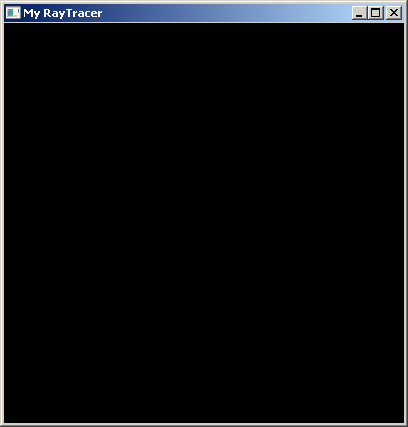
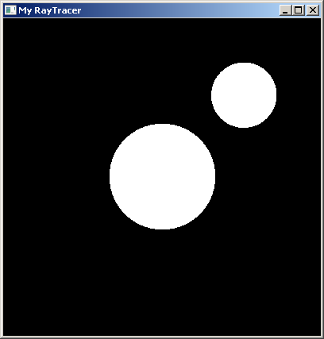
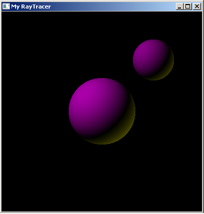

# Raytracer

This is a raytracer implemented using OpenGL.  
Currently there are two modules, one of which takes as input an object file and displays it using the OpenGL routines. The other module displays the output of the raytrace. The shading has not been accounted for yet.  
The geometry with 2 spheres and 2 point lights is hardcoded as of now.  

### Execution

Please install OpenGL2.0 to execute the program.  
Press **r** to switch between the object and Raytrace mode.  
In the raytrace mode, **w**, **a**, **s**, **d** can be used to move the eye position.  

### Development

The entire project has been written in C++. Unlike most raytracers, instead of rendering an image of the output, I have rendered it on the screen using OpenGL(2.0). The program also implements an .obj file importer and is capable of displaying the geometry in both, the raytracer output as well as the through OpenGL routines.  
The importer uses the **winged-edge** data structure for the geometry.

The following is the BSOD as mentioned in the first screen.

The following output is the intersection map of the rays with the objects.  

This is the output is the combine with the intersection map of the rays with the objects and the shading using the LAMBERT properties for the object materials.  

